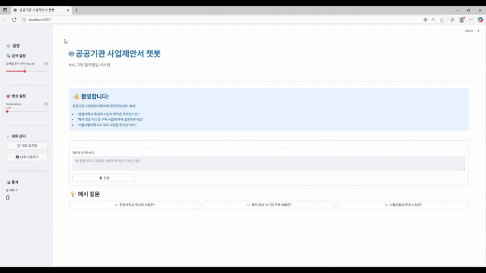

# Codeit-AI-1team-LLM-project
---
## 챗봇 서비스 시연


## 벡터 DB 대시보드 영상


# 1. 프로젝트 개요
- **B2G 입찰지원 전문 컨설팅 스타트업 – 'RFPilot'**
- RFP 문서를 요약하고, 사용자 질문에 실시간으로 응답하는 챗봇 시스템
> **배경**: 매일 수백 건의 기업 및 정부 제안요청서(RFP)가 게시되는데, 각 요청서 당 수십 페이지가 넘는 문건을 모두 검토하는 것은 불가능합니다. 이러한 과정은 비효율적이며, 중요한 정보를 빠르게 파악하기 어렵습니다.
> 
> **목표**: 사용자의 질문에 실시간으로 응답하고, 관련 제안서를 탐색하여 요약 정보를 제공하는 챗봇을 개발하여 컨설턴트의 업무 효율을 향상시키고자 합니다.
> 
> **기대 효과**: RAG 시스템을 통해 중요한 정보를 신속하게 제공함으로써, 제안서 검토 시간을 단축하고 컨설팅 업무에 보다 집중할 수 있는 환경을 조성합니다.
---
# 2. 설치 및 실행
---
### Prerequisites
- Python 3.12.3 설치됨
- Poetry 설치됨
- 저장소 클론 완료
## 🪟 Windows

```powershell
# 1. 프로젝트 폴더로 이동
cd Codeit-AI-1team-LLM-project

# 2. 가상환경 설정 및 의존성 설치
python -m poetry config virtualenvs.in-project true
python -m poetry env use 3.12.3
python -m poetry install

# 3. 가상환경 활성화
python -m poetry shell

# 4. 실행
python main.py
```
## 🍎 Mac / Linux

```bash
# 1. 프로젝트 폴더로 이동
cd Codeit-AI-1team-LLM-project

# 2. 가상환경 설정 및 의존성 설치
poetry config virtualenvs.in-project true
poetry env use 3.12.3
poetry install

# 3. 가상환경 활성화
poetry shell

# 4. 실행
python main.py
```
## 📦 패키지 추가 시

### Windows
```powershell
python -m poetry add 
git add pyproject.toml poetry.lock
git commit -m "Add package"
git push
```

### Mac/Linux
```bash
poetry add 
git add pyproject.toml poetry.lock
git commit -m "Add package"
git push
```

## 🔄 팀원이 패키지 추가했을 때

### Windows
```powershell
git pull
python -m poetry install
```

### Mac/Linux
```bash
git pull
poetry install
```
## 🛠 자주 쓰는 명령어

| 작업 | Windows | Mac/Linux |
|------|---------|-----------|
| 가상환경 활성화 | `python -m poetry shell` | `poetry shell` |
| 가상환경 종료 | `exit` | `exit` |
| 패키지 목록 | `python -m poetry show` | `poetry show` |

# 3. 프로젝트 구조
---
```
CODEIT-AI-1TEAM-LLM-PROJECT/
│
├── main.py                  # 실행 진입점
├── data/                    # 문서 및 벡터DB 저장 폴더
├── src/
│   ├── loader/              # 문서 로딩 및 전처리
│   ├── embedding/           # 임베딩, 벡터DB 생성
│   ├── retriever/           # 문서 검색기
│   ├── generator/           # 응답 생성기
│   ├── streamlit/           # UI 구성
│   └── utils/               # 공통 함수 모듈
└── README.md
```
- `main.py`: 전체 RAG 파이프라인 실행의 진입점입니다.
- `data/`: 원문 문서, 생성된 벡터DB 등이 저장됩니다.
- `src/loader`: PDF, HWP 문서를 텍스트로 추출하고 의미 단위로 분할합니다.
- `src/embedding`: 텍스트 임베딩 벡터를 생성하고 Chroma DB를 구축합니다.
- `src/retriever`: 사용자 질문에 대한 관련 문서를 벡터DB에서 검색합니다.
- `src/generator`: 검색된 문서 기반으로 LLM이 응답을 생성합니다.
- `src/streamlit`: Streamlit 기반 사용자 인터페이스를 구성합니다.
- `src/utils`: 설정 확인, 경로 설정 등 공통 유틸리티 함수들을 포함합니다.

# 4. 팀 소개
> 기본에 충실실하며 실제 사용 가능한 모델을 만들기 위해 끊임없이 노력하는 팀입니다.

## 👨🏼‍💻 멤버 구성
|지동진|김진욱|이유노|박지윤|
|-----|------|------|-------|
|||||
|||||
|||||

## 👨🏼‍💻 역할 분담
|지동진|김진욱|이유노|박지윤|
|------|--------------|---------------|---------------|
|PM/RAG|Data Scientist|Prompt Engineer|Prompt Engineer|
|프로젝트 총괄. 팀 회의 진행. 팀 혐업 환경 관리. RAG 개발. 대시보드 개발|RAG전략 수립. 학습 데이터 구성. 데이터 전처리 파이프라인 작성. 모델 성능관련 실험 진행|API 모델 선정 및 성능 비교. 프롬프트 개발. 모델 개선|API 모델 선정 및 성능 비교. 프롬프트 개발. 모델 개선|
---
# 5. 프로젝트 타임라인


---
# 6. 서비스 설명

## 서비스 아키텍쳐

## 데이터

## 모델
---
# 프로젝트 실행

## 모델

## 데이터

## 프론트엔드

## 백엔드
---
# Further Information

## 개발 스택 및 개발환경
- **언어**:  

- **프레임워크**:  

- **라이브러리**:     
- **클라우드 서비스**: 
- **도구**:   


## 협업 Tools


## 기타 링크
